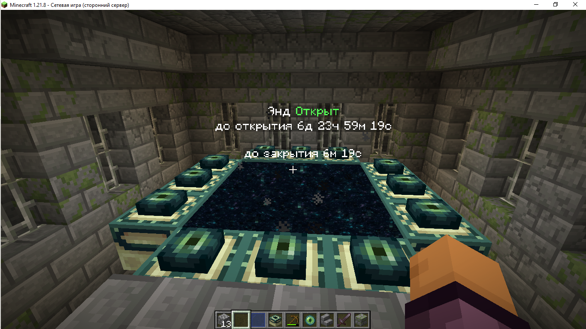
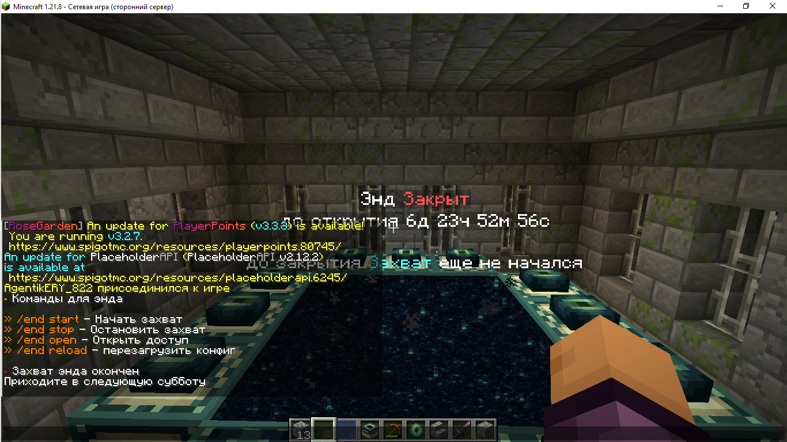

Простой и удобный плагин на захват энда 

Плагин имеет очень легкую настройку конфига,
а так-же плагин имеет несколько своих плейсхолдеров что упрощает работу с ним
вот и они

1 %end_status% - показывает статус энда закрыт или открыт
2 %end_open_time% - показывает сколько времени осталось до открытия энда
3 %end_stop_time% - оказывает сколько времени до закрытия энда

На скриншотах видна работа плагина

Плагин разработан студией EryDev 